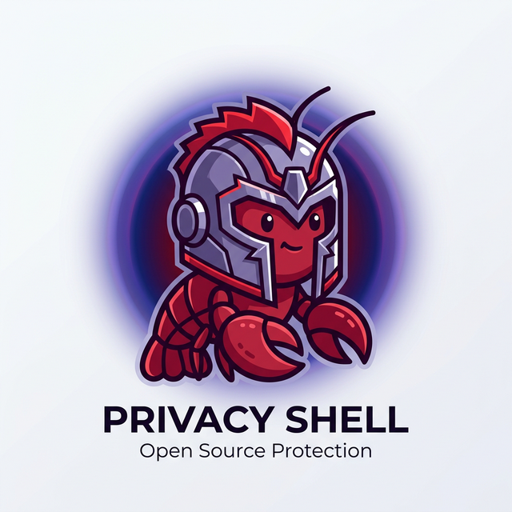

# OpenClaw 隐私过滤器插件
<div align="center">
  
</div>

[English](./README.md) | 简体中文

这是 [OpenClaw](https://github.com/openclaw/openclaw) 的一款尽力而为（Best-effort）的隐私保护插件，提供提示词路由转发、会话记录脱敏以及对外发送消息的打码处理功能。

## 功能介绍与架构

本插件通过钩住（hook）OpenClaw 的插件架构来实现以下三种主要的隐私控制：

1. **敏感提示词路由**
   当用户的提示词中匹配到预设的敏感模式（如密码、密钥等）时，插件会动态地拦截并覆盖原有的 AI 提供商和模型设置（例如，自动将带有敏感信息的请求转发给本地更安全的 Ollama 提供商）。

2. **会话记录脱敏**
   在会话消息写入到持久化本地 JSONL 结构的历史记录缓存之前，插件会扫描并涂黑（打码）所有匹配到的敏感字符串。

3. **对外消息脱敏**
   在最终消息被发送到具体的聊天渠道（如 Telegram、Discord 等）之前，可选择性地对敏感信息进行遮蔽处理。

### 限制说明
本插件并不会在网络层对历史记录中所有原始载荷（Payload）进行深度的底层拦截与替换。它依赖于官方支持的提供商（Provider）和聊天钩子（Chat Hook）API 进行内容审查和路由转发。

## 安装指南

作为一个独立的 OpenClaw 插件，您可以通过两种方式进行安装：

### 方式一：通过压缩包安装（推荐）
1. 从本仓库的 [Releases](#) 页面下载最新版本的 `.tgz` 压缩包。
2. 通过 OpenClaw CLI 进行安装及启用：
   ```bash
   openclaw plugins install ./文件路径/openclaw-privacy-filter-0.1.0.tgz
   openclaw plugins enable privacy-filter
   ```

### 方式二：通过本地链接安装（面向开发者）
克隆本仓库并直接软链接加载：
```bash
git clone https://github.com/bestcarly/openclaw-privacy-filter.git
cd openclaw-privacy-filter
openclaw plugins install -l .
openclaw plugins enable privacy-filter
```

## 配置说明

启用插件后，请更新您的 `openclaw` 配置文件以自定义您的隐私设置需求：

```json
{
  "plugins": {
    "enabled": ["privacy-filter"],
    "privacy-filter": {
      "enabled": true,
      "routeSensitivePrompts": true,
      "secureProvider": "ollama",
      "secureModel": "llama3.3:8b",
      "redactTranscript": true,
      "redactOutboundMessages": false,
      "redactionToken": "[REDACTED]",
      "customPatterns": ["my_secret_[A-Za-z0-9]{10,}"]
    }
  }
}
```

### 支持的隐私抹除匹配项
默认情况下，该插件会自动检测和拦截以下内容：
- 电子邮箱地址
- 中国大陆手机号
- AWS Access Key ID
- 各种 API Token（如 `sk-...`, `ghp_...`）
- Bearer 认证 Token
- 常见的密钥赋值语句（如 `password=`, `api_key=` 等）

您可以通过在配置文件的 `customPatterns` 数组中提供自定义的 JavaScript 正则表达式（字符串形式）来扩展拦截列表。

## 开源协议
MIT License
